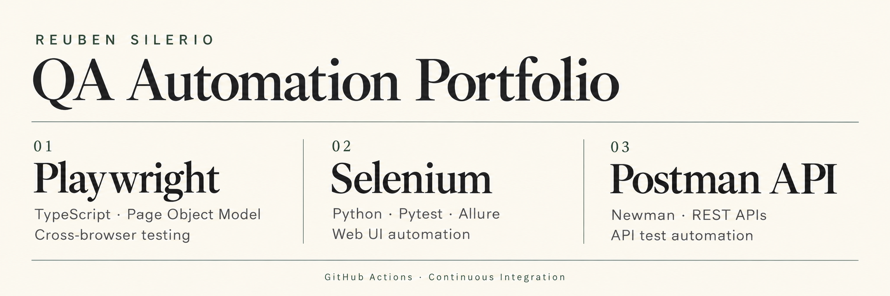

# Reuben Silerio
**QA Engineer · Web & Mobile Testing · UI & API Automation**

I turn requirements into test scenarios, investigate defects, and help teams make informed release decisions. My professional background spans functional, regression, exploratory, UAT, and production testing across web, Android, iOS, and mobile web.

My portfolio brings that testing experience into **Playwright + TypeScript**, **Selenium + Python**, and **Postman + Newman**, with automated execution through **GitHub Actions**.

[Explore projects](#featured-projects) · [CI and reporting](#ci-and-reporting) · [Live Allure report](https://siler1o.github.io/selenium-qa-automation-portfolio/) · [Test-case tracker](https://docs.google.com/spreadsheets/d/1E-rbgsHj4jv7pamglMdsREiQnfcl-aHWACqrRmAwD3w/edit?usp=drivesdk)

| Test design | Team coordination | Platform coverage |
| :--- | :--- | :--- |
| **400+ test cases maintained** | **6-person QA team** | **Web · Android · iOS · Mobile web** |

## Automation toolkit

## Featured projects

### 01 / Playwright · TypeScript · Cross-browser testing

**One implemented input-fields test case, executed in Chromium, Firefox, and WebKit.**

- Page Object Model separates page locators and reusable interactions from test orchestration.
- TC001 checks submitted text, appending, clearing, disabled state, keyboard navigation, and readonly behavior.
- Named `test.step()` blocks make each verification easy to follow in the HTML report.
- GitHub Actions runs the suite, retries failures, and retains HTML reports for investigation.

[**View project →**](https://github.com/siler1o/QA-Playwright-TypeScript-Automation) · [Test implementation](https://github.com/siler1o/QA-Playwright-TypeScript-Automation/blob/main/tests/TC001-input-fields.spec.ts) · [CI runs](https://github.com/siler1o/QA-Playwright-TypeScript-Automation/actions)

### 02 / Postman · Newman · API automation

**14 positive and negative scenarios against the Automation Exercise practice API.**

- GET, POST, PUT, and DELETE coverage for products, brands, search, login, and account lifecycle operations.
- JavaScript assertions distinguish HTTP status from the API's JSON `responseCode`, then validate structure and values.
- Generated test accounts support create → login → update → retrieve → delete flows, including login rejection after deletion.
- Newman runs the collection in GitHub Actions and preserves JUnit results for 14 days.
- Dependency guards block account operations when successful account creation has not been recorded.

[**View project →**](https://github.com/siler1o/postman-api-testing-portfolio) · [Collection & environment](https://github.com/siler1o/postman-api-testing-portfolio/tree/main/postman) · [CI runs](https://github.com/siler1o/postman-api-testing-portfolio/actions/workflows/api-tests.yml)

### 03 / Selenium · Python · UI regression

**26 planned UI scenarios implemented for Automation Exercise.**

- Registration, authentication, product discovery, cart operations, checkout journeys, reviews, invoice downloads, and scrolling.
- Reusable page objects, explicit waits, shared Pytest fixtures, and isolated registration data.
- Headless Chrome execution in GitHub Actions, with Allure results retained as artifacts.
- Successful eligible `main` runs generate and publish the Allure report to GitHub Pages.

[**View project →**](https://github.com/siler1o/selenium-qa-automation-portfolio) · [Live Allure report](https://siler1o.github.io/selenium-qa-automation-portfolio/) · [CI/CD workflow](https://github.com/siler1o/selenium-qa-automation-portfolio/blob/main/.github/workflows/selenium-ci.yml)

## CI and reporting

| Project | Automated execution | Evidence | Delivery |
| :--- | :--- | :--- | :--- |
| Playwright | Pushes and PRs to `main`; manual runs | HTML report; trace on first retry | Downloadable report artifact |
| Postman / Newman | Relevant pushes to `main`; PRs to `main`; manual runs | CLI output and JUnit artifact | Downloadable test results |
| Selenium / Pytest | Pushes and PRs to `main`; manual runs | Allure results and published report | Allure report deployed to GitHub Pages after successful eligible runs |

**CI is implemented in all three projects.** Selenium also demonstrates automated report deployment. These portfolios do not deploy the applications under test.

The badges link to current workflow results. Public practice-site availability can affect runs; a published report may represent an earlier successful execution.

## What I bring to a QA team

- **Requirements analysis:** convert expected behavior into functional, negative, and edge-case coverage.
- **Release verification:** smoke, regression, exploratory, QAT, UAT, and blue-green deployment checks.
- **Defect investigation:** clear reproduction steps, severity and business-impact assessment, fix verification, and follow-through.
- **QA coordination:** assign testing activities, track progress and blockers, and communicate release risks.
- **Practical automation:** maintainable page objects, meaningful assertions, reproducible test data, and CI evidence.

## Current focus

Expanding Playwright coverage, improving test reliability and failure diagnostics, and connecting UI and API checks to clear test documentation.

**Based in the Philippines · Open to remote or hybrid QA Engineer opportunities.**

[GitHub projects](https://github.com/siler1o?tab=repositories)
